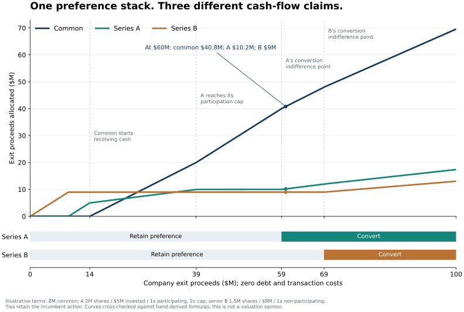
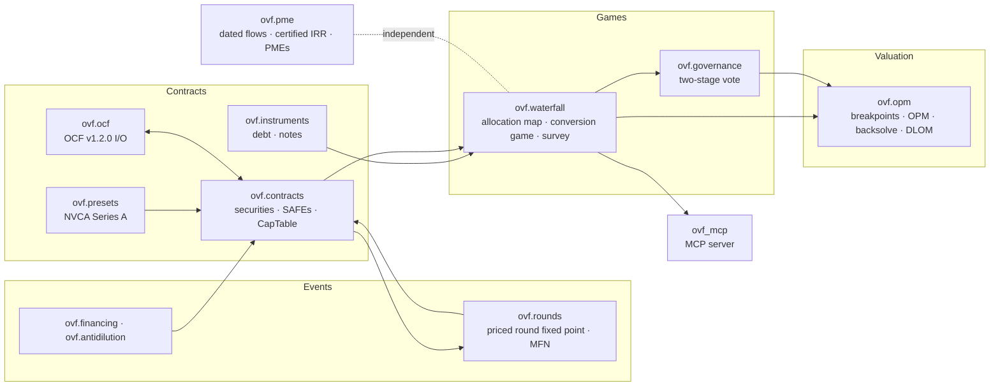

# Algorithmic Game Theory & Nash Equilibrium Solver for Multi-Class Private Equity

**Equilibria · Open Venture Framework (`ovf`)** — an executable semantics for private-equity
contracts. Given a cap table and an exit, it solves the conversion game every preferred class
plays against every other, certifies the equilibrium, and reconciles every dollar. Around that
core: priced rounds as fixed points, a two-stage governance vote, an Option Pricing Method that
refuses the tables it cannot price, and a fund-performance engine whose IRR never picks a root.


[](https://github.com/ogulcan-ozyavuz/equilibria-waterfall/actions/workflows/ci.yml)


| | |
|---|---|
| Solution concept | pure ε-Nash equilibrium of the conversion game, certified by an exhaustive unilateral-deviation check; exhaustive `2^n` survey for payoff uniqueness |
| Strategic layers | position-level conversion game · two-stage Requisite Holders vote · MFN elections resolved continuously |
| Fixed points | mixed pre/post-money SAFE rounds as one concave piecewise-affine equation with a uniqueness certificate |
| Valuation | Black–Scholes–Merton call spreads over engine-derived breakpoints, backsolve, four DLOM estimators |
| Fund performance | certified XIRR (Descartes–Jameson bound + Rolle isolation in log space), KS-PME, Direct Alpha, PME+, Long–Nickels ICM, mPME |
| Evidence | 2,211 tests · three independently written exact oracles · adversarial reviews · every refusal is explicit |
| Interfaces | Python API (`ovf`, alias `equilibria`) · CLI · MCP server for AI agents · OCF v1.2.0 read/write |

> **Status: research alpha, Apache-2.0.** Every result is conditional on the documented
> contract model. Existence and payoff uniqueness of the conversion equilibrium over arbitrary
> contracts are open research questions, stated as such below. Nothing here is a 409A
> valuation, a fairness opinion or legal advice.

**Contents** · [1 The problem](#1-the-problem) · [2 Supporting research](#2-supporting-research) ·
[3 The mathematical model](#3-the-mathematical-model) · [4 The Python engine](#4-the-python-engine) ·
[5 Evidence](#5-evidence-and-verification) · [6 Findings](#6-findings-produced-by-the-engine) ·
[7 Open problems](#7-open-research-problems) · [8 Reproduce, contribute, cite](#8-reproduce-contribute-cite)

---

## 1. The problem

### 1.1 Cap tables are machine-readable. Their payoffs are not.

The Open Cap Table Format encodes a preferred class with fields such as `seniority`,
`liquidation_preference_multiple`, `participation_cap_multiple` and `conversion_rights`.
No standard defines what those fields **pay** at a given exit value. Every spreadsheet, every
law-firm model and every valuation report re-implements that meaning, and the answer depends
on choices that are almost never written down: who converts, in which order claims are paid,
how a capped participant stops, what a vote does, which of several IRR roots is reported.

This repository treats that meaning as a mathematical object. A contract snapshot `θ` and an
exit `x` define a **game** among the preferred positions; its equilibrium defines the cash
allocation; and every number returned carries the assumptions, the input hash and the
verification that produced it.

### 1.2 Conversion is a game, not a sort

At an exit, each convertible preferred position chooses between its liquidation preference and
converting to common. One position's choice changes the residual that everyone else shares, so
the choices are **simultaneous and interdependent**. A USD 60M exit on an illustrative stack
(no debt, no dividends, 1:1 conversion):

| Position | Shares | Invested | Terms |
|---|---:|---:|---|
| Common | 8,000,000 | — | residual claimant |
| Series A | 2,000,000 | USD 5M | junior 1x **participating**, total payout capped at 2x |
| Series B | 1,500,000 | USD 9M | senior 1x non-participating |

Payoff matrix, **(Series A, Series B)** in USD millions:

| A ↓ / B → | B retains preference | B converts |
|---|---:|---:|
| **A retains** | (10.000, 9.000) | (10.000, 7.895) |
| **A converts** | **(10.200, 9.000) ← equilibrium** | (10.435, 7.826) |

The unique pure Nash equilibrium is *A converts, B retains*. B takes its senior USD 9M; A takes
20% of the USD 51M residual, USD 10.2M; common receives USD 40.8M; the three reconcile to
USD 60M exactly. A would fall to its USD 10M cap by deviating; B would drop to USD 7.826M.
Note that the profile A likes best — both convert — is not stable: **individually attractive
outcomes do not compose into a stable allocation**, which is precisely why the allocation has to
be *solved*.



In this stack A hits its participation cap at USD 39M and becomes indifferent to conversion at
USD 59M; B at USD 69M. The engine does not assume those kinks — it derives and verifies them
([breakpoints](docs/opm-breakpoints.md)).

### 1.3 Problem instances that motivated the engine

Each of these is a documented case where the semantics above decide real money, and where the
standard tooling either guesses or is silent.

**A · Valuing multi-class claims requires an equilibrium.** Gornall and Strebulaev (2020) value
venture-backed companies by modelling each share class's contract. Their payoff step is a
conversion game solved by iteration, reported as an observation on their sample:

> "As the first step in the payoff calculation, we assume that all shareholders convert their
> shares… Then we iterate through each class of shares that can choose whether or not to
> convert… For all of the companies we consider, this process converges to a Nash equilibrium."

No published existence, uniqueness or complexity result for this game was located while
surveying the literature. The engine makes the question *checkable on any table*: it certifies
the profile it returns and can enumerate every equilibrium ([findings](docs/findings.md)).

**B · The terms vary, and they bite.** Kaplan and Strömberg (2003) find participating preferred
in roughly 40% of 1987–1999 rounds; recent market reports show 1x non-participating as the
overwhelming norm. A tool that hard-codes one shape is wrong for the other, so every shape is
an explicit input ([fixtures](docs/fixtures.md)).

**C · A vote can erase a preference.** In *Alta Berkeley VI C.V. v. Omneon, Inc.* (Del. 2012)
a dissenting Series C-1 was converted to common by a majority vote of all preferred immediately
before a merger and lost its liquidation preference; *Greenmont Capital Partners I v. Mary's
Gone Crackers* (Del. Ch. 2012) turned on the same mechanism. The NVCA model charter's
mandatory conversion (s.5.1(b)) is exactly this term. Modelled as a two-stage game, it produces
payoffs that **fall as the exit rises** — see [§3.5](#35-governance-a-two-stage-game).

**D · Governance that does not move cash.** Broughman and Fried (2010) document VC carve-outs to
common in 11 of 50 sales, averaging USD 3.7M. Reading the NVCA Voting Agreement and charter
shows why that is a *different cap table*, not a payout modifier: drag-along and protective
provisions gate whether a sale happens, never how it is split ([governance](docs/governance.md)).

**E · The Option Pricing Method assumes what it should check.** Practice values classes as call
spreads over waterfall breakpoints. The arithmetic needs each payoff to be continuous, piecewise
linear and non-decreasing, with marginal weights summing to one. Under a mandatory-conversion
vote the payoff **steps**, and no combination of call spreads reproduces a step. On generated
governed tables the method is inapplicable in **33.9%** of cases; the unchecked construction
would have reported a median error of **6.4% of equity value** while still conserving value
exactly — invisible from inside the option maths ([opm-findings](docs/opm-findings.md)).

**F · Fund IRRs have more than one root.** PME research (Kaplan and Schoar 2005; Harris,
Jenkinson and Kaplan 2014; Gredil, Griffiths and Stucke 2014) rests on dated cash flows and
IRRs. A spreadsheet `XIRR` iterates from a guess and returns whichever root it lands on. The one
published Direct Alpha illustration this project could read has a Long–Nickels series with two
roots, **−27.26% and +5.97%**; the paper shows only the second ([pme](docs/pme.md)).

**G · A SAFE round is a fixed point.** Post-money SAFEs, pre-money SAFEs, the pool top-up and the
round price all depend on the fully diluted share count they jointly determine. Cooley's three
pricing conventions are negotiated economics, not algebra mistakes one solver can remove
([rounds](docs/rounds.md)).

---

## 2. Supporting research

What each source contributes, and how far this project read it. Rows marked *partial* or
*unverified* are flagged in the linked ledgers; nothing is cited beyond what was read.

**Venture contracts, valuation and bargaining**

| Source | Used for |
|---|---|
| Gornall, W. & Strebulaev, I. (2020). Squaring venture capital valuations with reality. *Journal of Financial Economics* 135(1), 120–143. [NBER w23895](https://www.nber.org/papers/w23895) | the conversion game as the payoff step of multi-class valuation; motivation for certifying the equilibrium |
| Kaplan, S. & Strömberg, P. (2003). Financial contracting theory meets the real world. *Review of Economic Studies* 70(2), 281–315. | prevalence of participating preferred; fixture term shapes |
| Broughman, B. & Fried, J. (2010). Renegotiation of cash flow rights in the sale of VC-backed firms. *Journal of Financial Economics* 95(3), 384–399. | carve-outs as renegotiation; why governance is modelled as gating plus one cash-moving vote |

**Model documents, case law and data standards**

| Source | Used for |
|---|---|
| NVCA Model Amended and Restated Certificate of Incorporation (October 2025; June 2019), Model Voting Agreement, Model Term Sheet (2019) — files hashed in [presets](docs/presets.md) | liquidation (s.2.1), mandatory conversion (s.5.1(b)), protective provisions (s.3.3), anti-dilution (4.4.4), presets |
| *Alta Berkeley VI C.V. v. Omneon, Inc.*, 41 A.3d 381 (Del. 2012); *Greenmont Capital Partners I, LP v. Mary's Gone Crackers, Inc.*, 2012 WL 4479999 (Del. Ch. 2012) — as cited in the NVCA charter, fn 64 | the collective-conversion mechanism and its cash consequence |
| Y Combinator, Post-Money SAFE v1.2, Discount-Only and MFN forms, and the SAFE User Guide | post- vs pre-money capitalization, MFN semantics, published worked examples reproduced as fixtures |
| Cooley GO, *Calculating share price with outstanding convertible notes or SAFEs* | the three negotiated round-pricing conventions |
| Open Cap Table Format v1.2.0 (tag `9f987b4`), JSON Schema read field by field | the OCF adapter, its refusals and three findings about OCF itself |

**Fund performance and public-market equivalents** (claim-by-claim ledger: [pme-sources](docs/pme-sources.md), 82 rows)

| Source | Used for |
|---|---|
| Kaplan, S. & Schoar, A. (2005). Private equity performance: returns, persistence, and capital flows. *Journal of Finance* 60(4), 1791–1823. | KS-PME (their ratio; largely liquidated funds, no NAV) |
| Harris, R., Jenkinson, T. & Kaplan, S. (2014). Private equity performance: what do we know? *Journal of Finance* 69(5), 1851–1882. | residual value as a terminal distribution in KS-PME |
| Gredil, O., Griffiths, B. & Stucke, R. (2023). Benchmarking private equity: the direct alpha method. *Journal of Corporate Finance* 81, 102360 (equations read in the 2014 SSRN draft). | Direct Alpha, PME+ and ICM algebra, the published Exhibit 5–6 fixture, the mPME eq. (11) index error |
| Sorensen, M. & Jagannathan, R. (2015). The public market equivalent and private equity performance. *Financial Analysts Journal* 71(4), 43–50 (*via secondary sources*). | KS-PME as a log-utility SDF valuation |
| Korteweg, A. & Nagel, S. (2016). Risk-adjusting the returns to venture capital. *Journal of Finance* 71(3), 1437–1470. | the restriction PME imposes; GPME as out of scope |
| Long, A. & Nickels, C. (1996). *A private investment benchmark.* AIMR conference paper. | the index comparison method and its short-position footnote |
| Rouvinez, C. (2003). Private equity benchmarking with PME+. *Venture Capital Journal*, August (*via Gredil et al. and US Patent 7,698,196*). | PME+ scale factor |
| Cambridge Associates, benchmark methodology (prose only) | the mPME, implemented as a labelled reconstruction |
| Brown, G., Gredil, O. & Kaplan, S. (2019). Do private equity funds manipulate reported returns? *JFE* 132(2), 267–297. | why NAV is an input, not a fact |
| ILPA Performance Template guidance (2025); CFA Institute, GIPS 2020 | practice conventions; GIPS's "PME" is a rate, not the KS ratio |

**Mathematics and numerics**

| Source | Used for |
|---|---|
| Jameson, G. J. O. (2006). Counting zeros of generalised polynomials: Descartes' rule of signs and Laguerre's extensions. *Mathematical Gazette* 90(518), 223–234 (Thm 3.1, Prop 3.6, Lemma 2.4). | the root bound and parity behind the certified IRR |
| Norstrom, C. (1972). A sufficient condition for a unique nonnegative internal rate of return. *JFQA* 7(3). | contrast: a sufficient condition, not a root count |
| Black, F. & Scholes, M. (1973), *Journal of Political Economy* 81(3), 637–654; Merton, R. (1973), *Bell Journal of Economics* 4(1), 141–183. | the call value in the OPM |
| Shewchuk, J. (1997). Adaptive precision floating-point arithmetic and fast robust geometric predicates. *Discrete & Computational Geometry* 18, 305–363. | exact running sums (`math.fsum`) behind every conservation check |
| Microsoft `XIRR` and LibreOffice `XIRR` documentation; ISDA 2006 Definitions §4.16 | day-count conventions; the counter-model for root selection |
| DLOM closed forms attributed to Chaffe, Finnerty, Longstaff and Ghaidarov | four estimators, reported separately; *attributions recalled and not verified against the publications* ([dlom](docs/dlom.md)) |

---

## 3. The mathematical model

Notation: `θ` is an immutable contract snapshot, `V` the gross exit, `C` transaction costs,
`x = max(V − C, 0)` distributable proceeds. All money is one base currency.

### 3.1 Absolute priority and the fixed-profile allocation map

Debt (term loans, venture debt, convertible notes with a stated exit treatment) settles first,
by ascending debt seniority, pro rata by claim within a tier, from an explicit `as_of` date.
The equity budget is `E = x − D`.

For a conversion profile $s \in \{0,1\}^n$ ($s_i = 1$: position $i$ converts), each
non-converted preferred position has claim $L_i = \ell_i I_i$ (multiple × invested capital,
plus accrued dividends). Tiers are paid in ascending seniority; with $R_{k-1}$ remaining and
active tier claim $Q_k$,

$$
B_k=\min(R_{k-1},Q_k),\qquad p_i=B_k\,\frac{L_i}{Q_k},\qquad R_k=R_{k-1}-B_k .
$$

The residual $R$ is shared by common, converted preferred and non-converted participating
preferred in common-equivalent weights $w_j$, each capped by its headroom
$h_j=\max(0,\,c_jI_j-p_j)$ (uncapped: $h_j=\infty$). This is capped pro-rata **water-filling**
at a cash-per-unit level $\lambda$:

$$
a_j=\min(h_j,\lambda w_j),\qquad \sum_{j\in\mathcal A(s)} a_j=R,\qquad W_j(s;x,\theta)=p_j+a_j .
$$

Feasibility is conservation within a cash tolerance:
$\bigl|\sum_j W_j - x\bigr|\le\varepsilon,\ \varepsilon = 10^{-8}+10^{-12}x$.
An unallocated option reserve counts in ownership and receives nothing.

### 3.2 The conversion game

$$
\mathcal G(x,\theta)=\bigl(N,\ \{0,1\}^N,\ u_i(s)=W_i(s;x,\theta)\bigr),\qquad N=\text{preferred positions}.
$$

Players are **positions** (`security_id`), not owners; a holder with several positions is
disclosed (`multi_position_holders`), not optimized as a coalition. Define the largest
profitable unilateral deviation

$$
r(s)=\max\Bigl\{0,\ \max_{i\in N}\bigl[u_i(1-s_i,s_{-i})-u_i(s)\bigr]\Bigr\}.
$$

A profile is returned only if $r(s^{\ast})\le\varepsilon$ — an $\varepsilon$-Nash certificate
computed by evaluating **all $n$ deviations** after the search, not inferred from it.

- **Search.** Gauss–Seidel best-response sweeps from the all-retain profile in stable ID order,
  accepting strict improvements beyond $\varepsilon$. A cycle or an exhausted budget raises
  `WaterfallConvergenceError`; nothing approximate is returned.
- **Survey.** `enumerate_equilibria` evaluates all $2^n$ profiles, keeps the feasible pure
  equilibria $\mathcal E$, and reports whether the payoff is unique,
  $\bigl|\{W(s):s\in\mathcal E\}\bigr|=1$. Cost $O(2^n)$ allocations, guarded at $n\le 12$.
- **Strategy vs payoff uniqueness.** Multiple equilibrium *profiles* are ordinary (indifferent
  positions). What a calculator needs is a unique equilibrium *payoff*. It held on every
  instance the checked-in exact-rational oracle enumerates; it is **not proven** in general.

### 3.3 Accrued dividends reduce to the same game

**Proposition 1** ([dividends](docs/dividends.md)). Fix `as_of`; let a position with accrued
dividend $A$ have $d=A/I$. Its dividend-free twin has multiple $m+d$ (forfeit, no cap),
$\min(m+d,c)$ with cap $c$ (cap includes dividends), $m+d$ with cap $c+d$ (cap excludes), or
shares $\times(1+d)$ (paid in kind). The dividend-bearing table and its twin are *the same
game*: every uniqueness statement transfers over the transformed parameter range.

### 3.4 Financing events as fixed points

**A priced round is one scalar equation.** With $T$ the post-round fully diluted count, the pool
$p(T)$, the price $1/P(T)$ and the shares left for SAFEs $A(T)$ are affine in $T$ under each of
Cooley's conventions. Each SAFE converts at the better of cap and discount,

$$
S_k(T)=I_k\,\max\!\Bigl(\tfrac{f_k}{P(T)},\ \tfrac{B_k(T)}{K_k}\Bigr),\qquad f_k=\tfrac1{1-d_k},
$$

a maximum of affine maps, so $g(T)=A(T)-\sum_k S_k(T)$ is **concave and piecewise affine**.

**Proposition** ([rounds](docs/rounds.md)). If the terminal slope $s_\infty>0$, the round has
exactly one solution. *(Concave with every slope $\ge s_\infty>0$, $g(0)<0$, so one root.)*
When $s_\infty\le 0$ the round is **refused**, and the margin is reported on every result as
`uniqueness_margin`. For homogeneous post-money capped SAFEs this reduces to the closed form

$$
a_i=\frac{I_i}{\min\{K_i,\,W(1-q-t)(1-d_i)\}},\quad B=\frac{C_0}{1-\sum_i a_i},\quad
T=\frac{B}{1-q-t},\quad S_i=a_iB .
$$

MFN SAFEs resolve **continuously** at each later issuance, for the whole instrument, by the
investor's election. Price-based anti-dilution is the NVCA 4.4.4 map

$$
CP_2 = CP_1\,\frac{A+B}{A+C},\qquad \text{ratio}=\frac{OIP}{CP_2},
$$

with full ratchet as the limit $A\to 0$ and the charter's definition of "deemed outstanding"
as a required input.

### 3.5 Governance: a two-stage game

A Requisite Holders mandatory conversion forces a set $F$ of positions to convert when approved.

- **Stage 2** — for each outcome, the remaining positions play $\mathcal G$.
  **Proposition G1:** a forced conversion is common stock with $u_i=\text{shares}_i\times\text{ratio}_i$
  units, so stage 2 is an ordinary table.
- **Stage 1** — holder $h$ compares the two unique stage-2 payoffs,
  $\Delta_h=\sum_{i\in P(h)}\bigl(W'_i-W_i\bigr)$, and votes sincerely; approval is decided in
  exact rational arithmetic against the charter threshold ("at least" vs "more than" is an
  input). A pivotal indifferent holder makes the outcome undetermined, and it is refused.

The governed payoff is a deterministic function of two unique payoff vectors and a vote, so it
**jumps** where the pivotal holder's gain crosses zero. On the table of §1.2 with a majority term:

| Exit | Vote | Common | Series A | Series B |
|---:|---|---:|---:|---:|
| USD 10,894,736 | approved | **7,578,946.78** | 1,894,736.70 | 1,421,052.52 |
| USD 10,894,737 | fails | **0.00** | 1,895,000.00 | 9,000,000.00 |
| USD 57.4M | fails | — | — | 9,000,000.00 |
| USD 57.6M | approved | — | — | 7,513,043.48 |

The first step sits at exactly $x=207{,}000{,}000/19$ and was found by solving for the root of
the pivotal gain, not by a grid: **one more dollar of sale price and the founders receive
nothing instead of USD 7.58M.**

### 3.6 Valuation: the Option Pricing Method, and where it stops

Breakpoints $0=k_0<k_1<\dots$ are **derived from the engine**: analytic candidates (preference
levels, caps, conversion indifference, vote flips) in exact rational arithmetic, then verified by
probing the waterfall on both sides; non-kinks are dropped and unpredicted kinks located.
Tranche values are Black–Scholes–Merton call spreads on total equity value,

$$
V_t=C(k_t)-C(k_{t+1}),\qquad \text{class value}_j=\sum_t w_{jt}\,V_t,\qquad \sum_t V_t=Se^{-qT},
$$

which telescopes to the discounted equity value **iff** every tranche's weights sum to one.

**Representability.** A call spread is continuous, so its span contains no step. If a class's
payoff jumps (as in §3.5), no weights reproduce it and `opm_allocate` raises
`OpmAssumptionError`; the checks — continuity, monotonicity, weight sums, measured linearity,
replay at the equity value — have no bypass flag. Backsolve calibrates to a transaction price
after verifying strict monotonicity across its bracket. Four DLOM closed forms are reported
separately; simulation places the true average-strike put **strictly between** Finnerty (below)
and Ghaidarov (above).

### 3.7 Fund performance: a certified XIRR

With per-date nets $a_i$ at year fractions $t_i$ (additive day counts: ACT/365F, ACT/365.25,
ACT/ACT-ISDA) and $\delta=\ln(1+r)$, the NPV is an **exponential sum** over the whole line:

$$
f(\delta)=\sum_i a_i\,e^{-\delta t_i},\qquad r\in(-1,\infty)\iff\delta\in\mathbb R .
$$

- **Descartes–Jameson.** The number of real roots, with multiplicity, is at most $V$ (sign
  changes of $a_i$ in date order) and $\equiv V \pmod 2$. So $V=0$ ⇒ no IRR, $V=1$ ⇒ exactly one.
- **Rolle isolation.** For $V\ge2$, $f_{k+1}=\sum_i a_i(\tau_k-t_i)e^{-\delta t_i}$ has one
  sign change fewer; the roots of each level are the critical points of the one above, so every
  real root is isolated in a monotone piece. All levels live in **log space** — a float
  normalisation once fabricated a false complete root set on coefficients spanning
  $10^{20}$ to $10^{-300}$, which is why.
- **Root bound.** Beyond a computable $\delta_{hi}$ the leading same-sign block is at least twice
  everything else; below $\delta_{lo}$ the trailing block is. No root lies outside.
- **Verification.** Each root is refined and checked against the backward-error scale
  $|f(\delta^{\ast})|\le10^{-10}\max\bigl(\sum|a_i|,\sum|a_i|e^{-\delta^{\ast}t_i}\bigr)$.
  Status is `unique`, `multiple` (all listed, none chosen), `none`, or `undetermined` — never a
  wrong `complete=True`.

On top of it, with $FV(X)=\sum_t X_t\,I_T/I_t$ and residual $NAV_T$:

$$
\text{KS-PME}=\frac{FV(D)+NAV_T}{FV(C)},\qquad
a=\operatorname{IRR}\{-C_t\tfrac{I_T}{I_t},\,+D_t\tfrac{I_T}{I_t},\,+NAV_T\},\qquad
s=\frac{FV(C)-NAV_T}{FV(D)},
$$

Direct Alpha $=a$ (continuous $\ln(1+a)$), PME+ with scale $s$, the Long–Nickels position
$V_d=V_{d^-}\,I_d/I_{d^-}+C_d-D_d$ (reconciled against $FV(C)-FV(D)$), and the mPME
$X_t=NAV^{m}_{t^-}I_t/I_{t^-}+C_t$, $w_t=D_t/(D_t+NAV_t)$, which provably never goes short.
Stated cents that fail to cancel in binary are treated as zero only within $\varepsilon\sum|\text{legs}|$;
computed nets within $8n\varepsilon G$ — float noise is never allowed to create a root.

---

## 4. The Python engine

### 4.1 Architecture



### 4.2 Engineering invariants

- **Immutable snapshots.** Securities and cap tables are frozen; a financing returns a *new*
  table. Nothing mutates the input.
- **No default for any economic convention.** Day count, pricing convention, NAV policy, vote
  threshold, index lookup, interim-NAV policy: every one is a required keyword. A missing
  convention is a `TypeError`, not a silent choice.
- **Refusal over approximation.** Unsupported instruments, non-unique outcomes, cycles, pivotal
  indifference, steps under the OPM, ambiguous CSV input — each raises a typed error
  (`ValueError` family, `WaterfallConvergenceError`, `GovernanceIndeterminateError`,
  `OpmAssumptionError`) with an actionable message.
- **Provenance on every result.** `input_hash` (SHA-256 of canonical JSON), `engine_version`,
  `assumptions`, the tolerance, and the verification quantities (`max_unilateral_gain`,
  `conservation_error`, residuals).
- **Exact arithmetic where it decides a question.** Vote thresholds are `Fraction`s; breakpoint
  candidates are rational; sums are correctly rounded (`math.fsum`).

### 4.3 Install

```bash
git clone https://github.com/ogulcan-ozyavuz/equilibria-waterfall.git
cd equilibria-waterfall
python -m pip install -e '.[dev]'      # Python 3.11+; add '.[mcp]' for the MCP server
```

### 4.4 Solve and certify a conversion game

```python
import equilibria as eq  # same implementation as `import ovf`

ct = eq.CapTable(securities=[
    eq.common(8_000_000, holder_id="founders", security_id="common"),
    eq.preferred(2_000_000, 2.50, seniority=2, participating=True, participation_cap=2.0,
                 holder_id="series_a", security_id="series_a"),
    eq.preferred(1_500_000, 6.00, seniority=1,
                 holder_id="series_b", security_id="series_b"),
])

report = ct.waterfall_detailed(60_000_000)
for payout in report.payouts:
    print(payout.holder_id, round(payout.amount), payout.converted)
# founders 40800000 False
# series_a 10200000 True
# series_b 9000000 False

assert report.max_unilateral_gain <= report.tolerance      # ε-Nash certificate
assert abs(report.conservation_error) <= report.tolerance  # every dollar reconciled

survey = eq.enumerate_equilibria(ct.securities, 60_000_000)
print(survey.states_evaluated, survey.payoff_unique)
# 4 True
```

### 4.5 Price the classes with the Option Pricing Method

```python
from ovf.opm import OpmInputs, opm_allocate

result = opm_allocate(ct.securities, inputs=OpmInputs(
    equity_value=60_000_000, volatility=0.6, time_to_liquidity=3.0, risk_free_rate=0.04,
))
for cv in result.class_values:
    print(cv.security_id, round(cv.value), f"{cv.pct_of_equity:.1%}")
# common 37693023 62.8%
# series_a 11470283 19.1%
# series_b 10836694 18.1%
print(len(result.schedule.breakpoints), "engine-derived breakpoints")  # 6
```

Pass a `collective_conversion=` term that makes the payoff step and the same call raises
`OpmAssumptionError`, naming the exit, the position and the jump.

### 4.6 Benchmark a fund against the public market

```python
from datetime import date
from ovf.pme import BenchmarkIndex, CashFlow, FundCashFlows, IndexLevel, NavObservation, pme_report

dec31 = lambda y: date(y, 12, 31)
fund = FundCashFlows(
    name="GGS 2014 Exhibit 5", currency="USD", basis="net_lp",
    flows=(
        CashFlow(date=dec31(2001), kind="contribution", amount=100),
        CashFlow(date=dec31(2003), kind="contribution", amount=100),
        CashFlow(date=dec31(2003), kind="distribution", amount=25),
        CashFlow(date=dec31(2005), kind="contribution", amount=50),
        CashFlow(date=dec31(2005), kind="distribution", amount=150),
        CashFlow(date=dec31(2007), kind="distribution", amount=150),
        CashFlow(date=dec31(2009), kind="distribution", amount=100),
    ),
    nav=NavObservation(date=dec31(2010), value=75),
)
levels = (100, 78, 100, 111, 117, 135, 142, 90, 113, 131)
index = BenchmarkIndex(name="GGS index", currency="USD", return_basis="total_return_gross",
                       levels=tuple(IndexLevel(date=dec31(2001 + i), level=v)
                                    for i, v in enumerate(levels)))

report = pme_report(fund, index, as_of=dec31(2010), stale_nav="refuse", day_count="ACT/365F",
                    lookup="exact", max_gap_days=0, nav_history=None, interim_nav=None,
                    max_nav_gap_days=None)
print(round(report.fund_irr.irr, 4), round(report.ks_pme.ks_pme, 4))    # 0.1752 1.6668
print(report.ln_pme.icm_irr.status,
      [round(r.rate, 4) for r in report.ln_pme.icm_irr.roots])           # multiple [-0.2726, 0.0597]
print([f.code for f in report.flags])     # ['IRR_NOT_UNIQUE', 'ICM_WENT_SHORT']
```

### 4.7 Command line

| Command | What it does |
|---|---|
| `python -m ovf waterfall --demo F5b` | allocate one exit, print the certificate and assumptions |
| `python -m ovf sweep --demo F8a` | allocate a range of exits |
| `python -m ovf equilibria --demo F3` | enumerate every conversion equilibrium |
| `python -m ovf safe ...` | solve a priced round with SAFEs |
| `python -m ovf pme report --flows F.csv --index I.csv ...` | the full fund report from CSV, every convention a required flag |

### 4.8 For AI agents: the MCP server

`ovf-mcp` exposes 12 typed tools over the Model Context Protocol — `exit_waterfall`,
`exit_sweep`, `conversion_equilibria`, `cap_table_summary`, `safe_priced_round`,
`anti_dilution_adjustment`, `dilutive_issuance`, `debt_claim`, `convert_note`, `ocf_import`,
`ocf_export`, `example_cap_tables` — plus the docs as resources. Every allocation result carries
an adapter `verification` block that is **independent of the engine**: net exit recomputed from
the arguments, seniority order checked, and the unilateral-deviation check redone by exhaustive
enumeration. Omitted contract terms are reported, never silent ([mcp](docs/mcp.md)).

### 4.9 Module map

| Module | Engine | What it covers | Doc |
|---|---|---|---|
| `ovf.waterfall`, `ovf.contracts` | `waterfall-v3` | tiers, pari passu, caps, conversion ratios, the game, the survey | [semantics](docs/semantics.md) |
| `ovf.instruments` | — | term debt, venture debt, convertible notes; dated accrual, absolute priority | [debt](docs/debt.md) |
| dividends in `ovf.contracts` | — | cumulative / non-cumulative, forfeit or PIK, cap basis, Proposition 1 | [dividends](docs/dividends.md) |
| `ovf.rounds`, `ovf.contracts.safes` | `rounds-v1` | priced rounds over an existing table, existing pools, mixed SAFEs, MFN, Cooley conventions | [rounds](docs/rounds.md) |
| `ovf.antidilution`, `ovf.financing` | `antidilution-v1` | broad/narrow weighted average, full ratchet, issuance to a new snapshot | [anti-dilution](docs/antidilution.md) |
| `ovf.governance` | `governance-v1` | Requisite Holders mandatory conversion as a two-stage vote | [governance](docs/governance.md) |
| `ovf.presets` | `presets-v1` | NVCA Series A with every bracketed choice required | [presets](docs/presets.md) |
| `ovf.ocf` | — | OCF v1.2.0 read/write, 43 transaction types partitioned applied / ignored / refused | [ocf](docs/ocf.md) |
| `ovf.opm` | `opm-v1` | breakpoints, OPM, backsolve, DLOM | [opm](docs/opm.md) |
| `ovf.pme` | `pme-v1` | dated flows, certified IRR, KS-PME, Direct Alpha, PME+, ICM, mPME, report, CSV | [pme](docs/pme.md) |
| `ovf_mcp` | — | MCP server | [mcp](docs/mcp.md) |

---

## 5. Evidence and verification

| Check | Result |
|---|---|
| Test suite (CI on Python 3.11 and 3.12) | **2,211 passed**, 1 skipped (the optional OCF schema test needs an external schema checkout) |
| `ovf.pme` | 535 tests · `ovf.opm` 568 · `ovf_mcp` 100 |
| Lint / types | `ruff` clean · `mypy --strict`-style settings clean |

**Independent implementations, not just more tests.** A shared misreading of the specification
passes every test written from it; only agreement with code written by a different route
survives. Three such oracles are checked in:

- **Waterfall:** an exact-rational water-filling allocator over `fractions.Fraction`, enumerating
  every profile of small games (`tests/test_equilibrium_reference.py`).
- **OPM:** an oracle that imports none of the modules under test and evaluates no option formula —
  it integrates the payoff against the lognormal density by Gauss–Legendre quadrature. Exact
  agreement on **36,009 breakpoints and 2,441 steps**; call spreads match quadrature to
  **6.3e−15** of equity value ([opm-findings](docs/opm-findings.md)).
- **PME:** a 60-digit `Decimal` / `Fraction` oracle written by a different model family *without
  reading the engine*, against 19 hand-derived fixtures including Microsoft's published `XIRR`
  example and the Gredil–Griffiths–Stucke exhibits ([pme-fixtures](docs/pme-fixtures.md)).

**Adversarial review.** The PME module went through three independent reviews that attacked it
with exact Sturm counts, subnormal and overflow inputs, malformed CSVs and performance cliffs;
every finding is either fixed with a regression test or recorded as a decision
([decision record](docs/pme-contract.md)). Every derivation in `docs/*fixtures*.md` was done by
hand before being asserted; `reviewed_by` stays empty until an outside specialist signs it.

---

## 6. Findings produced by the engine

Things this codebase established that were not visible before it existed:

1. **Under a mandatory-conversion vote, payoffs are not monotone in the exit.** Two steps on the
   §1.2 table: at 207,000,000/19 the common loses USD 7.58M for one extra dollar of price; at
   USD 57.5M Series B loses USD 1.49M for USD 0.2M more. In generated governed tables, some
   position's cash fell as the exit rose in 1,246 of 3,000; without the term, in none.
2. **The OPM is inapplicable on about a third of governed tables** (677 of 2,000; 95% Wilson
   31.8–36.0%), with 0 of 4,000 refusals on the same tables ungoverned.
3. **Finnerty and Ghaidarov bracket the payoff they both approximate** — below in all 24 grid
   cells and above from σ√T ≈ 0.42, by 5 to 154 standard errors; neither closed form is exact.
4. **A published Direct Alpha illustration hides a second IRR root**, and its index position
   goes short on 2007-12-31 — the method's own documented pathology, inside its own example.
5. **Microsoft's published `XIRR` value is an iterate, not the root:** exact root
   0.37336253351883151 vs displayed 0.373362535.
6. **Two of three "governance" mechanisms move no cash;** the roadmap's "class-majority
   conversion" is, in the charter, a vote of *all* preferred together; the NVCA model charter has
   no Series B.
7. **OCF v1.2.0 cannot express participating-uncapped preferred, its own sample package fails its
   own schema, and `StockClass.seniority` and `ConvertibleIssuance.seniority` run in opposite
   directions** ([ocf](docs/ocf.md)).
8. **Attribution corrections:** Kaplan–Schoar's PME has no NAV term; PME+ appeared in *Venture
   Capital Journal*; KS-PME > 1 ⇔ Direct Alpha > 0 needs a negative first net as well as one sign
   change.

---

## 7. Open research problems

- **Existence and payoff uniqueness** of pure equilibria in the conversion game for general
  contract structures — a proof (supermodularity or a potential argument) or an explicit
  counterexample. Both would be a contribution.
- **Owner-level games:** one beneficial owner across several positions optimising jointly.
- **Strategic voting** and coalitions in place of the sincere two-stage vote.
- **A certified IRR for high sign-change series** without the conservative `undetermined` on
  1,000-date alternating flows (interval arithmetic in log space).
- **Payoff uniqueness under exit-triggered anti-dilution.**
- **Selection-corrected tail inference** (the planned `vc-powerlaw`), fed through these contract
  semantics so that TVPI, PME and fair value become posterior distributions rather than points.

Scope boundaries that change a number today are listed in [limitations](docs/limitations.md):
carve-outs, granted-option settlement, escrow and earnouts, tax, FX, side letters, fund carry,
subscription-line reconstruction, recallable distributions.

---

## 8. Reproduce, contribute, cite

```bash
python -m pytest                 # 2,211 tests
python -m ruff check src tests examples
python -m mypy src
python examples/pme_walkthrough.py         # reproduces the published GGS figures, asserts each
python docs/github-launch/reproduce_example.py   # the §1.2 example, 1,001 exits (needs matplotlib)
```

The most valuable contribution is a **counterexample**: explicit contract terms, the player
definition, the cash basis, and an independently derived payout that disagrees with the engine.
See [CONTRIBUTING](CONTRIBUTING.md), the [calculation issue template](.github/ISSUE_TEMPLATE/calculation-issue.md),
the [roadmap](docs/roadmap.md) and the [changelog](CHANGELOG.md).

Maintained by **Ogulcan Ozyavuz** as part of the Open Venture Framework. Cite via
[CITATION.cff](CITATION.cff). Licensed [Apache-2.0](LICENSE).
