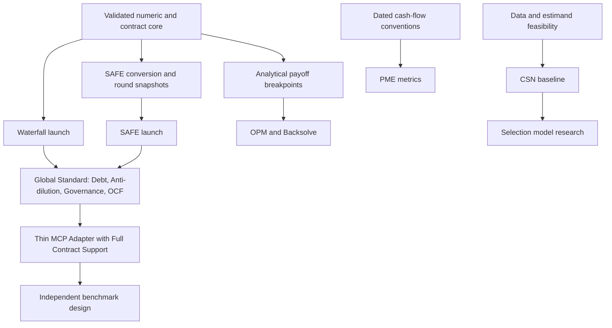

# OVF / Equilibria roadmap

Updated 2026-09-15. Owner: Ogulcan (proposed sole maintainer). Horizon: next quarter
in detail, subsequent research as conditional initiatives. Public dates are not committed.

## Strategy and outcomes

1. **Trustworthy calculations:** supported contract rules have independent fixtures,
   explicit assumptions, conservation checks and reported solver failures.
2. **External reuse:** another developer can install the package and reproduce a
   financing/exit example without maintainer intervention.
3. **Reproducible research:** claims trace to sources and data; publications follow
   implemented, used and evaluated artifacts.

The six proposed launches share a single Python distribution and test suite initially.
`equilibria` remains an alias to the `ovf` implementation. Separate repositories or PyPI
packages require demonstrated independent users and stable boundaries first.

## Prioritization (MoSCoW)

| Initiative | Theme | Priority | Size / confidence | Dependency | Completion evidence |
|---|---|---|---|---|---|
| Correctness repair, numeric policy, independent oracle | Trust | Must | M / high | Existing prototype | Local checks and documented semantic limits |
| waterfall-engine launch | Reuse | Must | M / medium | Correctness, independent contract review | Reproducible walkthrough and external installation trial |
| safe-math launch | Reuse | Must | M / medium | Scoped conversion, verified fixtures | Review of cap/discount/pool cases and round-to-exit workflow |
| Basic provenance | Trust | Must | S / high | Calculation APIs | Input fingerprint, assumptions, engine revision and diagnostics |
| Global standard: Debt & Convertible Notes | Scope | Must | M / medium | Scoped waterfall/SAFE core | Seniority 0 payout, accrued interest, maturity conversion |
| Global standard: Anti-dilution & Down-round | Scope | Must | M / medium | Cap table snapshots, priced round solve | Broad/Narrow weighted average, full ratchet, pay-to-play |
| Global standard: Governance & Class Voting | Scope | Must | M–L / medium | Waterfall solver, preference rules | Majority of class conversion, drag-along constraints |
| Global standard: OCF & NVCA presets | Reuse | Must | M / medium | Extended domain model | OCF JSON parser/serializer, NVCA reference templates |
| Thin MCP adapter | Reuse | Should | S–M / medium | Global standard instrument API | Agent tool calls with full contract support and traces |
| open-pme | Research | Should, after MCP | L / medium | Signed dated flows, metric conventions | Independent metric fixtures and research use |
| open-opm | Research | Could, gated | L–XL / low | Correct payout breakpoints, domain review | Published derivations, calibration and edge-case validation |
| vc-powerlaw baseline | Research | Could, gated | M for baseline; XL for selection / low | Data and estimand feasibility | Simulation recovery and sourced empirical sample |
| Fund waterfall, pacing, POMDP and RL | Research | Later | XL / low | Cash-flow ledger, validated transition model | Independent accounting and policy baselines |

Sizes are planning bands, not quotations: S is one narrow deliverable, M spans several
implementation/review cycles, L combines multiple independently testable components,
XL has unresolved research or data dependencies. Original hour estimates describe
possible coding sessions; they do not establish launch readiness.

## Capacity and sequence

Working assumption, to revisit with actual availability: one maintainer, 30 hours/week,
65% planned implementation/review capacity = 19.5 hours/week (about 78 hours per four-week
month). The rest covers user feedback, debugging and administration. Domain-review wait
time is additional. Limit work in progress to one launch plus maintenance.

| Period | Primary outcome | Optional work if the acceptance gate is passed |
|---|---|---|
| Month 1 | Core corrections, documented scope, independent financial fixtures, public development setup | First waterfall walkthrough |
| Month 2 | External trials and waterfall launch; SAFE demonstration and fixture review | Initial debt/note fixtures |
| Month 3 | Global standard core: Debt, Anti-dilution, Governance and OCF adapter | Pre-release benchmark fixtures |
| Month 4 | Thin MCP adapter release (supporting full global standard contracts) | PME / data feasibility study |
| Thereafter | Select next research module using adoption and available evidence | PME, OPM or tail research; no simultaneous commitment |

## Not now and reconsideration triggers

- **Six repositories/packages:** avoid duplicated validation and release work. Reconsider
  when modules have independent adopters, versioning needs and maintainers.
- **General 409A report generator:** reconsider after OPM methods and report assumptions
  have been reviewed for an explicitly selected purpose/jurisdiction.
- **Three DLOM variants at once:** select one sourced, reviewed baseline first.
- **All three Cooley conventions and mixed instruments:** add after one convention has
  reference fixtures and users who need the alternatives.
- **NumPyro selection as part of the first tail release:** require identifiable data,
  parameter-recovery tests and a defensible likelihood first.
- **Benchmark paper from MCP alone:** require an independent evaluator, task distribution,
  baseline results and a distinct research contribution.
- **Five publication promises / calendar LTS promise:** eligibility, evidence and maintenance
  capacity determine dates. A year label will match the actual release year.

## Publication gates

JOSS requires more than six months of active public development and demonstrated
research use; a local prototype does not start or prove that history. A public repository,
CI, changelog and contribution path are early deliverables. A module is not automatically
paper-sized because its calculations work. [JOSS requirements](https://joss.readthedocs.io/en/latest/submitting.html)

CFR requires a concrete replication target and usable data. NeurIPS submission planning
requires a benchmark/measurement contribution and the actual year's track requirements.
Equilibrium existence, uniqueness or counterexamples are research outcomes, not guaranteed
implementation tasks. Funding requires an eligibility and capacity check before a proposal.

## Review cadence

Review progress and observed capacity every two weeks during the first launches; replan
monthly. Track blocked acceptance gates, unresolved numerical bugs, external installation
successes and repeat usage. Re-estimate from measured work; do not use line coverage or
GitHub stars as a completion percentage.
